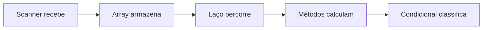

# 01 — Lógica de programação

Nesta trilha você aprende a transformar um problema em passos que o computador consegue executar. O ponto de chegada é um analisador de notas interativo que reúne os conceitos estudados.

## O que você vai aprender

- guardar dados em variáveis;
- escolher o tipo adequado para cada valor;
- receber dados com `Scanner` e mostrar resultados;
- calcular e comparar com operadores;
- tomar decisões com `if`, `else` e `switch`;
- repetir tarefas com `for`, `while` e `do-while`;
- organizar valores em arrays;
- criar métodos com parâmetros e retorno;
- entender onde uma variável pode ser usada, o chamado **escopo**.

## Trilha recomendada

| Ordem | Conteúdo | Pergunta principal |
| ---: | --- | --- |
| 1 | [Fundamentos e entrada de dados](docs/01-fundamentos.md) | Como guardar e receber informações? |
| 2 | [Tomada de decisões](docs/02-decisoes.md) | Como o programa escolhe um caminho? |
| 3 | [Estruturas de repetição](docs/03-repeticoes.md) | Como repetir sem duplicar código? |
| 4 | [Arrays e matrizes](docs/04-vetores-e-matrizes.md) | Como guardar vários valores relacionados? |
| 5 | [Métodos e escopo](docs/05-metodos.md) | Como dividir e reaproveitar a lógica? |
| 6 | [Exercícios](../03-exercicios/README.md#parte-1--lógica-de-programação) | Como praticar sem solução pronta? |

## Exemplo rápido

```java
double media = 7.5;

// A ordem importa: a primeira condição verdadeira encerra a decisão.
if (media >= 7.0) {
    System.out.println("Aprovado");
} else if (media >= 5.0) {
    System.out.println("Recuperação");
} else {
    System.out.println("Reprovado");
}
```

### Entendendo o código

`media` guarda um número decimal. O `if` testa primeiro a regra de aprovação; somente se ela for falsa, o programa verifica a recuperação. O `else` cobre o caso restante.

### Na prática

Esse mesmo formato aparece em descontos por faixa, validação de idade, limites de saque e classificação de pedidos.

## Projeto prático

O [`AnalisadorDeNotas`](src/main/java/br/com/logica/projeto/AnalisadorDeNotas.java) recebe notas, calcula média, maior e menor valor e informa a situação do estudante.



## Como executar

Dentro desta pasta:

```bash
mvn test
mvn exec:java
```

O menu permite executar cada assunto separadamente. Os testes conferem as principais regras do analisador.

## Desafio

Adicione ao analisador um método que conte quantas notas ficaram acima da média. Escreva primeiro o que o método recebe e o que retorna.

## Resumo

Você começou com dados simples, aprendeu a decidir e repetir ações e terminou separando o programa em métodos. Agora está pronto para representar dados e comportamentos juntos com POO.

[Voltar à página inicial](../README.md) · [Avançar para POO](../02-poo/README.md)
