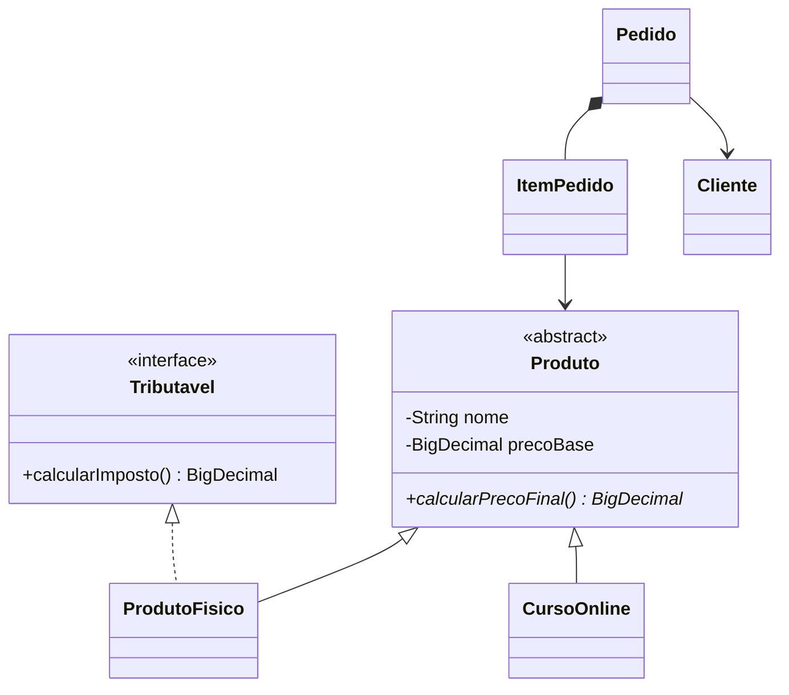

# 02 — Programação Orientada a Objetos

À medida que um programa cresce, variáveis e métodos soltos ficam difíceis de organizar. A **Programação Orientada a Objetos (POO)** agrupa dados e comportamentos em objetos com responsabilidades claras.

Aqui você constrói mentalmente uma loja com clientes, produtos, itens e pedidos. O exemplo é pequeno, mas mostra como os conceitos trabalham juntos.

## O que você vai aprender

| Conceito | Problema que ajuda a resolver | Onde aparece |
| --- | --- | --- |
| classe e objeto | representar elementos do sistema | `Cliente`, `Pedido` e `App` |
| construtor e `this` | iniciar objetos válidos e diferenciar atributo de parâmetro | classes de domínio |
| encapsulamento | impedir alterações que quebram regras | atributos privados e métodos de negócio |
| getters e setters | controlar leitura e alteração de dados | getters; setters evitados quando não fazem sentido |
| abstração e herança | reunir o que produtos têm em comum | `Produto`, `ProdutoFisico`, `CursoOnline` |
| `super` e sobrescrita | iniciar a classe mãe e especializar comportamentos | construtores e `@Override` |
| polimorfismo e casting | usar tipos diferentes por uma referência comum | `Produto produto` |
| interface | declarar uma capacidade | `Tributavel` |
| composição | formar um objeto com outros objetos | `Pedido` possui itens e cliente |

## Mapa do projeto



- `CursoOnline` **é um** `Produto`: herança;
- `Pedido` **possui** itens: composição;
- `ProdutoFisico` **é capaz de** calcular imposto: interface.

## Trilha recomendada

1. [Classes, objetos, construtores e `this`](docs/01-classes-e-objetos.md)
2. [Encapsulamento, getters e setters](docs/02-encapsulamento.md)
3. [Abstração, herança e `super`](docs/03-abstracao-e-heranca.md)
4. [Polimorfismo, sobrescrita e casting](docs/04-polimorfismo.md)
5. [Interfaces](docs/05-interfaces.md)
6. [Composição](docs/06-composicao.md)
7. [Exercícios](../03-exercicios/README.md#parte-2--programação-orientada-a-objetos)

## Exemplo rápido

```java
Produto teclado = new ProdutoFisico(
        "Teclado mecânico",
        new BigDecimal("250.00"),
        new BigDecimal("20.00")
);
```

### Entendendo o código

A variável possui o tipo geral `Produto`, mas o objeto criado é um `ProdutoFisico`. Assim, o pedido trabalha com qualquer produto sem conhecer a regra específica de todos eles. Ao calcular o preço, Java executa a versão sobrescrita do objeto real.

### Na prática

Lojas usam ideia semelhante para tratar produtos físicos, digitais e assinaturas dentro do mesmo carrinho, embora cada tipo tenha sua própria regra de preço.

## Como executar

Dentro desta pasta:

```bash
mvn test
mvn exec:java
```

O programa monta um pedido e mostra seus itens e total. Os testes validam regras como não finalizar um pedido vazio.

## Desafio

Crie `Assinatura` como outro tipo de `Produto`. Ela recebe valor mensal e quantidade de meses. Tente adicioná-la ao pedido sem modificar as classes `Pedido` e `ItemPedido`.

## Resumo

POO não é apenas criar muitas classes. É escolher responsabilidades claras, proteger regras e fazer objetos colaborarem de modo compreensível.

[Voltar à lógica](../01-logica-programacao/README.md) · [Voltar à página inicial](../README.md)
