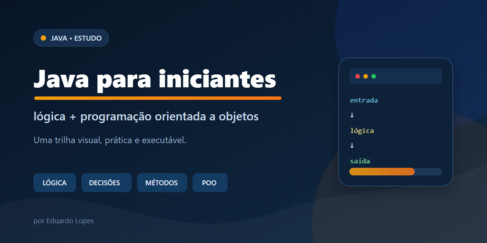
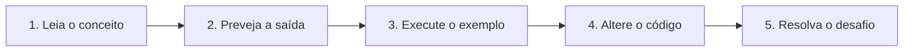
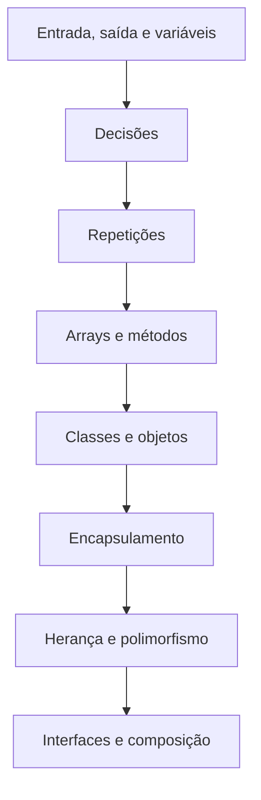

<p align="center">
  
</p>

# Java para iniciantes ☕

Uma trilha curta, prática e executável para aprender **lógica de programação** e **Programação Orientada a Objetos (POO)** com Java.

O material foi pensado para quem está começando: cada assunto apresenta o problema que resolve, um exemplo pequeno, uma aplicação prática e um desafio. Você pode ler no GitHub ou executar tudo no computador.

## Por onde começar



Se esta é sua primeira experiência com programação, siga a ordem:

1. [Lógica de programação](01-logica-programacao/README.md)
2. [Programação Orientada a Objetos](02-poo/README.md)
3. [Exercícios progressivos](03-exercicios/README.md)

## 📚 Conteúdos

| Trilha | O que você vai aprender | Projeto prático |
| --- | --- | --- |
| [01 — Lógica](01-logica-programacao/README.md) | variáveis, tipos, entrada e saída, operadores, decisões, laços, arrays, métodos e escopo | analisador de notas |
| [02 — POO](02-poo/README.md) | classes, objetos, construtores, encapsulamento, herança, polimorfismo, interfaces e composição | sistema de pedidos |
| [03 — Exercícios](03-exercicios/README.md) | desafios organizados por nível, sem solução pronta | caixa eletrônico e evolução da loja |
| [04 — Imagens](04-imagens/) | capa editável em SVG e versão PNG | divulgação no GitHub e LinkedIn |

## O que existe no repositório

```text
java-para-iniciantes/
├── 01-logica-programacao/  # Primeiro módulo e analisador de notas
├── 02-poo/                 # Segundo módulo e sistema de pedidos
├── 03-exercicios/          # Lista única de prática progressiva
├── 04-imagens/             # Recursos visuais
├── CONTRIBUTING.md         # Como colaborar
├── PUBLICACAO_LINKEDIN.md  # Texto de divulgação para personalizar
└── pom.xml                 # Executa os testes dos dois módulos
```

## Como executar

### Pré-requisitos

- JDK 17 ou superior;
- Maven 3.9 ou superior;
- uma IDE Java, como IntelliJ IDEA ou VS Code, é opcional.

### Testar todo o repositório

Na pasta raiz:

```bash
mvn clean test
```

Esse comando compila os dois módulos e executa os testes automatizados.

### Executar os projetos

```bash
cd 01-logica-programacao
mvn exec:java
```

Depois, volte à raiz e execute o exemplo de POO:

```bash
cd ../02-poo
mvn exec:java
```

> **Maven** é uma ferramenta que baixa as bibliotecas usadas pelo projeto e automatiza tarefas como compilar e testar.

## Como estudar sem apenas copiar

Antes de executar um exemplo, tente prever o resultado. Depois, troque valores, provoque um erro de propósito e explique com suas palavras por que o comportamento mudou. O aprendizado acontece quando você testa uma hipótese, não quando apenas lê o código.

Quando um termo for novo, consulte o [glossário rápido](01-logica-programacao/docs/glossario.md).

## Mapa da evolução



## Licença e autoria

Material distribuído sob a [licença MIT](LICENSE). O conteúdo original de POO e sua identidade visual creditam **Eduardo Lopes**; a reorganização mantém essa atribuição.
